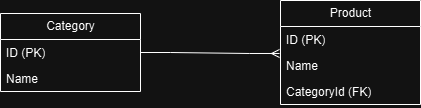

# Windows Forms Rakendus - Kategooriate ja Toodete Halduse Süsteem

## Ülevaade

See projekt on Windows Forms rakendus, mis võimaldab hallata kategooriaid ja nendele vastavaid tooteid. Rakendus kasutab SQLite andmebaasi ja on ehitatud C# keeles, kasutades Entity Framework Core'i.

## Funktsionaalsus

1. **Kategooriate haldus**
   - Kuva olemasolevad kategooriad.
   - Lisa, muuda kategooriaid.

2. **Toodete haldus**
   - Kuva valitud kategooria tooted.
   - Lisa, muuda tooteid, mis on seotud konkreetse kategooriaga.

3. **Andmete salvestamine**
   - Salvestab muudatused andmebaasi, kasutades "Save"-nuppu.

## Kasutatud tehnoloogiad

- **Keeled:** C#
- **Andmebaas:** SQLite
- **ORM:** Entity Framework Core (EF Core)
- **Kasutajaliides:** Windows Forms

## Kuidas projekti käivitada

1. **Eeltingimused**
   - Installi Visual Studio (koos .NET Frameworki ja Windows Forms App tugi).
   - Veendu, et SQLite on saadaval.

2. **Projektifaili avamine**
   - Ava `.sln` fail Visual Studios.

3. **Rakenduse käivitamine**
   - Vajuta `F5` või vali menüüst "Start".
   - Rakendus loob andmebaasi ja täidab selle algandmetega, kui see on esmakordselt käivitatud.

## Rakenduse kasutamine

1. Ava rakendus.
2. Kuva kategooriad vasakpoolses tabelis.
3. Vali kategooria, et näha seotud tooteid parempoolses tabelis.
4. Tee vajalikud muudatused ja salvesta, vajutades "Save"-nuppu.

## Andmebaasi ülesehitus

**Tabel: Categories**
- `Id`: Unikaalne ID (int)
- `Name`: Kategooria nimi (string)

**Tabel: Products**
- `Id`: Unikaalne ID (int)
- `Name`: Toote nimi (string)

**ERD diagramm**

